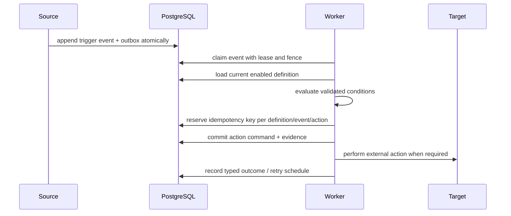

# Automation Engine Contract

Status: approved design; implementation follows the shared condition foundation introduced in migrations `0026`–`0027`.

## Definition

An automation has a name, enabled/paused state, one trigger, a validated condition document, ordered actions, timezone, version and audit attribution. Definitions are data. Client team names and role names never appear in engine branches.

Supported triggers:

- `SCHEDULE`
- `LABEL_ADDED`
- `LABEL_REMOVED`
- `CUSTOMER_CREATED`
- `CUSTOMER_FIELD_CHANGED`
- `CONVERSATION_OPENED`
- `CONVERSATION_CLOSED`
- `MANUAL`

Supported actions:

- `SEND_CAMPAIGN`
- `SEND_MESSAGE`
- `ADD_LABEL`
- `REMOVE_LABEL`
- `ASSIGN_TEAM`
- `ASSIGN_AGENT`
- `UPDATE_CUSTOMER_FIELD`
- `WEBHOOK`

## Execution flow

## Safety rules

- Maximum condition depth is `4`; maximum nodes `50`; a group has at most `20` children.
- Actions execute in declared order, but each action owns an idempotency key so a crash cannot duplicate completed work.
- Retries use bounded exponential backoff and typed terminal reasons.
- Webhooks require HTTPS, DNS/IP validation on configuration and delivery, redirect refusal, size/time limits and encrypted credentials.
- A definition version is immutable for an execution. Editing creates a new version for later events.
- Disabling prevents new claims; it does not erase execution history.
- Loops are blocked by causation depth and per-definition/event uniqueness.

## Persistence planned

`automation_definitions`, `automation_versions`, `automation_events`, `automation_runs`, `automation_action_runs` and a contentless due queue. All tenant content tables use FORCE RLS; queue discovery contains tenant and job identifiers only.
