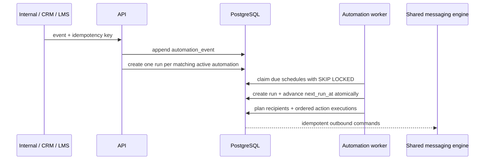

# Automation Engine

Status: durable trigger scheduling and the MVP executor are implemented in migrations `0028`–`0032`.

## Product surfaces

The signed-in workspace exposes three views: **Templates**, **My Automations**, and **Runs & Logs**. Nineteen product presets create independent editable drafts. There is no application-level automation count limit. The builder renders human-readable `WHEN → FOR → THEN` blocks and never exposes workflow JSON.

An automation holds one extensible trigger, a dynamic target, up to 50 ordered steps, optional schedule data, safety policy, timezone, lifecycle state and optimistic version. The initial catalogue contains 24 trigger contracts, including education events that may arrive from the internal API, a webhook bridge or a future LMS/CRM. It does not create course or student data.

## Durable execution flow

`automation_events` rejects reuse of an idempotency key with different canonical payload content. `automation_runs` has a second uniqueness fence on `(tenant, automation, idempotency_key)`. A restart before commit creates nothing; a restart after commit finds the existing run. Scheduled runs use `schedule:<scheduled instant>` as their key and advance the cursor in the same tenant transaction.

The schedule contract supports one-time, daily, weekly, monthly, bounded custom recurrence and event-relative offsets. Daily/weekly/monthly calculation uses the automation timezone; a run stores its absolute scheduled instant.

## WhatsApp templates

`whatsapp_templates` stores the provider id, name, language, category, status, components, variables and last synchronization time per connected asset. The automation API returns only synchronized `approved` templates. The builder selects by database id and binds every template parameter to a source — the contact's name, their WhatsApp number, a contact field or fixed text, with an optional fallback — the same bindings a broadcast uses (see `CAMPAIGN_ENGINE.md`). Activation re-checks approval, that every parameter is bound and that every field still exists. The executor fills the template for each recipient when it runs, builds Meta's components and stores them with a preview; a recipient the template cannot be filled for fails on its own.

A `dynamic_audience` target names a saved audience. Each run resolves its members afresh — contacts narrowed by name, labels, labelled conversations or a hand-picked list — so a scheduled automation ("every day at 17:00, send this template to the audience called VIPs") always reaches who matches at that moment. A retired audience, or one whose conditions a filter cannot express exactly, fails the run rather than reaching an approximation of it.

The manual synchronization endpoint resolves the WABA from the configured phone-number asset, follows Meta pagination, upserts the remote catalogue, and disables templates removed remotely. Provider synchronization and live send verification remain dependent on authorized Meta assets. An empty library is shown as a configuration requirement; it is never filled with fabricated provider templates.

## Persistence and isolation

- `automation_templates`: immutable product presets.
- `automations`: tenant definition, state, version, next/last run.
- `automation_events`: append-only idempotent trigger intake.
- `automation_runs`: production/test execution evidence, separate from Campaigns.
- `automation_recipients`: one row per customer/identity; nullable identities are still duplicate-safe.
- `automation_action_executions`: one ordered, durable action per recipient and workflow step.
- `automation_work_queue`: global contentless due-work index; customer data remains behind tenant RLS.
- `automation_logs`: append-only step evidence.
- `whatsapp_templates`: synchronized provider catalogue.

Every tenant content table has forced RLS and tenant-qualified foreign keys. Permissions are separate for read, create, edit, activate, pause and test. Owner and Admin receive the initial grants; custom roles can be configured through the permission catalogue.

## Current completion boundary

Implemented: workflow validation, 19 draft presets, lifecycle/version fencing, approved-template validation, manual Meta catalogue sync, template variable bindings with preview, event ingestion, idempotent run creation, restart-safe schedule materialization, contact/label/saved-audience recipient planning, durable ordered actions, delay resume, WhatsApp outbox enqueue, label and custom-field actions, outbound receipt reconciliation, run list, and the full three-view browser surface.

Explicit boundary: saved-view and course audiences, assignment, internal-notification and webhook actions, automation test-recipient execution, recipient/log detail endpoints, and an optional approval queue are not implemented. Those shapes fail visibly if they reach the executor. Live Meta verification still requires the customer’s authorized app and WhatsApp assets.
