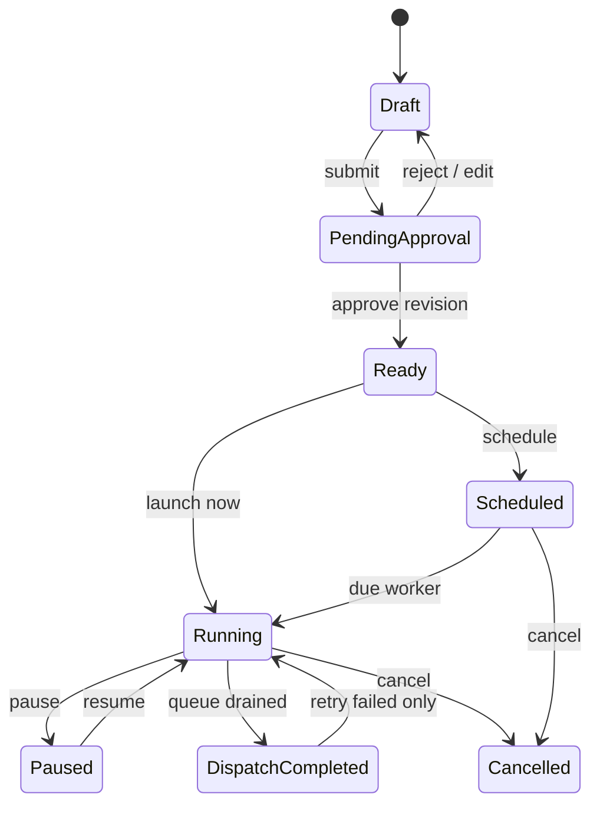

# Campaign Engine Contract

## Lifecycle



The repository currently implements draft revisions, validation, revision-bound approval, immediate and one-time scheduled launch, pause/resume/cancel, recipient evidence, test send, failed-only retry and campaign reporting. Explicit submit metadata and recurring schedules remain the next campaign changes.

## WhatsApp broadcasts

In the product a campaign is a WhatsApp broadcast: a business may start a conversation on WhatsApp only with a template Meta approved. The browser sets one up in four steps — the WhatsApp number it goes from, the approved template and where each of its variables comes from (beside a WhatsApp-style preview), the audience, and send now or at a time in the operator's zone — then one confirmation creates the draft and takes it through freeze, approval and launch as far as the operator's permissions allow. A refused step keeps the saved campaign, so a retry edits it rather than creating a second one.

A broadcast's content names a catalogue template by id and binds every parameter (`header:1`, `body:2`, `button:0:1`):

```json
{ "template": { "id": "<whatsapp_templates.id>", "parameters": {
  "header:1": { "source": "display_name", "fallback": "there" },
  "body:1": { "source": "field", "fieldId": "<custom field>", "fallback": "English" },
  "body:2": { "source": "static", "value": "on Sunday" },
  "button:0:1": { "source": "phone" } } } }
```

The server refuses a template that is not approved on the campaign's number, a binding left out, or a field that does not exist (422 `campaign_template_invalid`); stores the catalogue's name and language; and derives the revision's variables from the bindings (`body_1: "field:<uuid>"`, `body_2: "static:on Sunday"`). Freezing the audience resolves each variable per contact. Planning fills the template from the frozen values — the fallback where a contact had none, and a skipped recipient when a parameter ends up empty — builds Meta's components, and stores them with a preview on the outbound row. A template paused after the draft stops validation (409 `campaign_template_unavailable`), and one paused after launch is not sent. Text content and the older name-only template content keep working as before.

The same bindings drive an automation's `send_whatsapp_template` step, so a template is filled the same way wherever it is sent.

## Audience rule

A reusable audience stores a validated dynamic condition document. Preview and approval show the definition and an estimated count. At execution time the worker re-evaluates the current eligible population, applies current consent and suppression, then writes an immutable audience snapshot and recipient rows. Later customer edits do not mutate an execution already started.

## Delivery evidence

For every recipient the system keeps eligibility/exclusion reason, rendered variables, outbound command, attempts, provider IDs, command state, delivery state, timestamps, error category and retry relationship. `outcome_unknown` is terminal for automatic retry.

## Scheduling

The recurring scheduler will support one-time, daily, weekly, monthly and bounded custom recurrence with timezone, start/end, enabled/paused, `next_run_at` and `last_run_at`. The database owns due rows so deploys and restarts cannot lose a run. DST calculation happens from the named timezone, then stores an instant.
