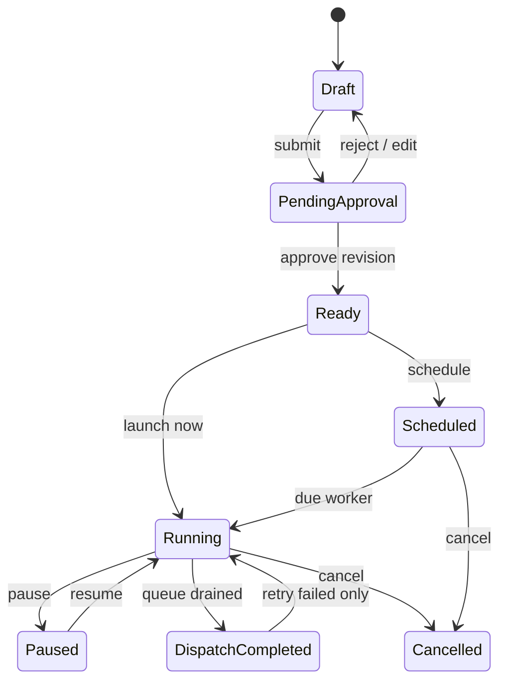

# Campaign Engine Contract

## Lifecycle

The repository currently implements draft revisions, validation, revision-bound approval, immediate and one-time scheduled launch, pause/resume/cancel, recipient evidence, test send, failed-only retry and campaign reporting. Explicit submit metadata and recurring schedules remain the next campaign changes.

## Audience rule

A reusable audience stores a validated dynamic condition document. Preview and approval show the definition and an estimated count. At execution time the worker re-evaluates the current eligible population, applies current consent and suppression, then writes an immutable audience snapshot and recipient rows. Later customer edits do not mutate an execution already started.

## Delivery evidence

For every recipient the system keeps eligibility/exclusion reason, rendered variables, outbound command, attempts, provider IDs, command state, delivery state, timestamps, error category and retry relationship. `outcome_unknown` is terminal for automatic retry.

## Scheduling

The recurring scheduler will support one-time, daily, weekly, monthly and bounded custom recurrence with timezone, start/end, enabled/paused, `next_run_at` and `last_run_at`. The database owns due rows so deploys and restarts cannot lose a run. DST calculation happens from the named timezone, then stores an instant.
