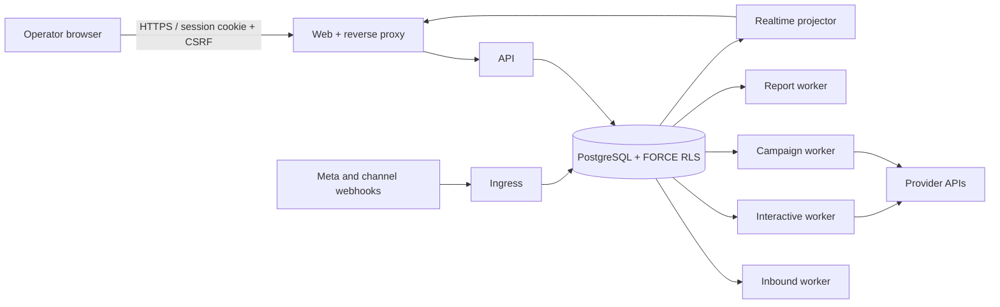

# Production Architecture

## Runtime shape

The platform is a modular TypeScript application deployed as separate process roles from one build artifact. PostgreSQL is the source of truth and owns tenant isolation, durable queues, idempotency, campaign evidence and scheduled work.

## Module boundaries

| Module | Owns | Does not own |
| --- | --- | --- |
| IAM | sessions, membership, roles, permission keys, scopes | UI visibility as an authorization decision |
| Channels | credentials, webhook verification, provider capability contracts, message attempts | campaign approval or customer consent policy |
| Contacts | customer record, scoped identities, consent, suppressions, typed metadata | guessed identity merges |
| Conversations | lifecycle, timeline, unread, assignment, handoff, priority, notes | provider credential management |
| Segmentation | versioned condition AST, saved views, reusable audiences | unsafe arbitrary SQL expressions |
| Campaigns | revisions, approval, execution snapshots, recipients, retries, costs, exports | direct synchronous bulk sends |
| Automation | approved trigger/action definitions and execution evidence | unbounded scripts or secret-bearing browser actions |
| Reporting | authorized projections and asynchronous exports | direct table access from the browser |

## Core invariants

1. Every tenant-owned table uses forced row-level security and tenant-qualified foreign keys.
2. The API authorizes by permission key and resource scope, never role display name.
3. An accepted command and its durable work row commit in one transaction.
4. Provider attempts are recorded before network I/O; ambiguous outcomes are never retried automatically.
5. Dynamic audiences are evaluated at execution time and frozen into immutable execution evidence.
6. Conditions use a closed, versioned field/operator vocabulary with bounded depth and node count.
7. Secrets remain in server configuration or encrypted credential records and never return to the browser.

The detailed historical design and failure semantics remain in [architecture.md](./architecture.md) and the ADR directory.
