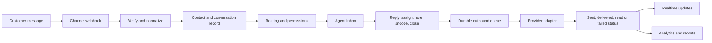
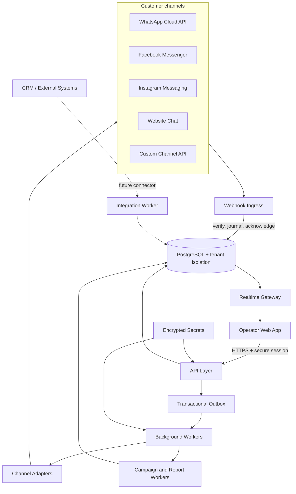

# CONVO
## Phased Delivery Plan & Technical Scope

**Product:** Omnichannel Customer Operations Platform
**Prepared for:** Digital School / Yasofian Digital School
**Purpose:** A clear, sequential description of what will be designed, developed, tested, and delivered.

## Product objective

CONVO will give the business one operational workspace for customer conversations across WhatsApp, Facebook Messenger, Instagram, Website Chat, and approved custom channels. The platform will connect conversations to customer profiles, teams, permissions, campaigns, and measurable outcomes.

The delivery sequence below is intentional. Each phase produces a usable, reviewable result and creates the foundation for the next phase.

## End-to-end operating flow

## Phase 1 — Business discovery and solution definition

### Objective

Translate the business workflow into an agreed product scope and an implementation-ready specification.

### Work included

1. Map the customer journey from the first message to resolution.
2. Define the initial channels and the account information required for each channel.
3. Define users, teams, roles, permissions, and visibility boundaries.
4. Define conversation states, assignment rules, priorities, business hours, and escalation rules.
5. Define customer fields, tags, consent requirements, and reporting KPIs.
6. Confirm the MVP acceptance criteria with business and technical stakeholders.

### Deliverables

- Approved product scope.
- Business Requirements Document (BRD).
- Role and permission matrix.
- User journeys and workflow map.
- API and integration checklist.
- MVP acceptance criteria.

## Phase 2 — UX, UI system, and application shell

### Objective

Create a consistent operator experience that is clear, fast, and suitable for daily support work.

### Work included

1. Establish the visual system: typography, spacing, color tokens, states, and accessibility rules.
2. Design the authenticated application shell with a collapsible navigation rail, responsive layout, and account menu.
3. Design the Inbox, Channels, Contacts, Broadcasts, Analytics, People, and Settings experiences.
4. Define loading, empty, error, permission-denied, offline, and read-only states for every major screen.
5. Support English and Arabic layouts with correct bidirectional behavior and Western digits.
6. Validate the layouts at desktop, tablet, mobile, and 200% zoom.

### Deliverables

- UI screens and reusable component specifications.
- Responsive interaction states.
- Accessibility and localization rules.
- Reviewable frontend implementation connected to the agreed API contracts.

## Phase 3 — Platform foundation, authentication, and workspace model

### Objective

Build the secure foundation that supports both a single-company deployment and a multi-company SaaS model.

### Work included

1. Implement login, logout, session expiry, password recovery, CSRF protection, and secure cookies.
2. Implement workspaces/tenants with strict data isolation.
3. Implement users, teams, roles, permissions, ownership, and audit events.
4. Enforce authorization at the API and database layers.
5. Add idempotency and request correlation for state-changing operations.
6. Define versioned database migrations and the OpenAPI contract.

### Deliverables

- Secure sign-in flow.
- Workspace and membership model.
- Role and permission administration.
- Audit trail.
- Versioned database schema.
- Documented API contract.

## Phase 4 — Channel catalogue and provider connections

### Objective

Allow an administrator to connect, monitor, and manage messaging channels from one place.

### Work included

1. Provide channel cards for WhatsApp, Messenger, Instagram, Website Chat, and Custom Channel.
2. Add connection states: Connected, Needs Attention, Not Connected, and Coming Soon.
3. Add channel-specific connection forms and validation.
4. Store provider credentials encrypted on the server; never expose secrets to the browser.
5. Implement signed webhook verification, event journaling, deduplication, and health checks.
6. Implement channel adapters so each provider can keep its own limits, templates, windows, and event vocabulary.
7. Add a safe connection test and an outbound test path.

### Deliverables

- Channel management screen.
- Connection setup and health status.
- Webhook endpoint and verification flow.
- Provider adapter contract.
- Channel setup runbook.

## Phase 5 — Unified Inbox and customer workspace

### Objective

Give agents one focused workspace for handling conversations and understanding the customer context.

### Work included

1. Build a unified conversation queue with search, filters, saved views, priority, status, channel, team, assignee, tags, and custom fields.
2. Build the conversation timeline for text, attachments, delivery states, internal notes, and system events.
3. Add reply and private-note composers with channel-aware capabilities.
4. Add a collapsible customer panel containing profile, identities, attributes, consent, notes, and history.
5. Add realtime updates with reconnect and catch-up behavior.
6. Keep customer data and conversation visibility scoped to the operator’s permissions.

### Deliverables

- Production-style Inbox.
- Conversation detail view.
- Customer profile and history.
- Realtime update behavior.
- Empty, loading, error, and permission-denied states.

## Phase 6 — Assignment, routing, and team operations

### Objective

Ensure every conversation reaches the right person and remains governed by clear ownership rules.

### Work included

1. Assign and reassign conversations to agents or teams.
2. Support handoff requests, acceptance, rejection, expiry, and audit history.
3. Support collaborators without changing the primary owner.
4. Add priority, snooze, reopen, close, and escalation actions.
5. Apply routing rules using channel, team, workload, tags, customer fields, and business hours.
6. Prevent unauthorized access to another agent’s Inbox or conversation.

### Deliverables

- Routing and assignment panel.
- Team and queue behavior.
- Handoff workflow.
- Ownership and escalation audit events.
- Permission acceptance tests.

## Phase 7 — Broadcasts and campaign operations

### Objective

Provide a controlled campaign workflow that prevents accidental sends and respects channel rules.

### Work included

1. Create campaigns as drafts.
2. Select an audience using segments, tags, consent, channel identity, and custom-field filters.
3. Compose channel-compatible content and templates.
4. Preview the message and run a test send to an explicitly authorized recipient.
5. Review the audience count, exclusions, channel constraints, and expected send volume.
6. Schedule or launch the campaign through a durable queue.
7. Apply provider limits, rate controls, retries, and recipient-level delivery tracking.
8. Allow failed-only retry while keeping unknown outcomes protected from automatic duplicate sends.

### Deliverables

- Campaign builder.
- Audience and filter experience.
- Preview and test-send flow.
- Scheduler and durable dispatch process.
- Recipient ledger.
- Campaign status and failure handling.

## Phase 8 — Analytics, reporting, and exports

### Objective

Turn operational activity into reliable information for management decisions.

### Work included

1. Show conversation volume by date, channel, team, and agent.
2. Measure first response time, resolution time, open conversations, and workload.
3. Show campaign funnel metrics: targeted, attempted, accepted, delivered, read, replied, failed, and unknown.
4. Provide filters by period, channel, campaign, team, and status.
5. Add trends, KPI cards, and clearly published denominators.
6. Generate CSV exports as background jobs with controlled download access.

### Deliverables

- Analytics dashboard.
- Campaign and operational reports.
- Filtered trend views.
- Export job status and secure download.

## Phase 9 — Public APIs and external integrations

### Objective

Make CONVO extensible without coupling the core Inbox to any one external system.

### Work included

1. Publish versioned REST APIs and webhook subscriptions.
2. Add API keys, scopes, request signing, idempotency, and delivery logs.
3. Define a generic CRM connector contract.
4. Add CRM field mapping, synchronization direction, conflict handling, and retry policy.
5. Keep CRM work in an integration worker so CRM downtime does not stop conversations or replies.
6. Add future connectors without changing the core conversation model.

### Deliverables

- OpenAPI specification.
- Developer integration guide.
- Webhook subscription and delivery history.
- CRM connector design and mapping document.

## Phase 10 — Quality, security, deployment, and handover

### Objective

Release a supportable MVP with evidence that the critical flows work.

### Work included

1. Unit tests for domain rules and authorization.
2. Integration tests against PostgreSQL for transactions, RLS, idempotency, and failure paths.
3. Contract tests for OpenAPI and channel adapters.
4. Security tests for tenant isolation, permissions, CSRF, signatures, SSRF controls, and secret handling.
5. End-to-end browser tests for login, channel setup, Inbox, assignment, campaign, and reports.
6. Accessibility and visual regression checks.
7. Production deployment with web, API, database, workers, health checks, logs, backups, and migration runbook.
8. Handover session for administrators and developers.

### Deliverables

- Tested release candidate.
- Deployment configuration and runbook.
- Admin and developer documentation.
- Known limitations and support handover.
- Production acceptance checklist.

## Technical architecture

### Architecture principles

- PostgreSQL is the source of truth for tenant data, conversations, campaigns, audit events, and delivery evidence.
- The browser never connects directly to the database.
- Webhooks acknowledge quickly after verification and durable journaling; slow CRM, AI, or media work runs asynchronously.
- API commands write the business change and its queue record in one transaction.
- Workers re-check permission, consent, channel readiness, and version fences immediately before provider I/O.
- Realtime events describe a change; the client reloads the authorized source record instead of trusting an unverified payload.
- Each integration is isolated behind a contract and can be added or replaced without rewriting the Inbox.

## Suggested MVP sequence

The recommended MVP order is:

1. Discovery and acceptance criteria.
2. UX/UI system and application shell.
3. Authentication, workspace, roles, and permissions.
4. Channel catalogue and the first approved Meta connection.
5. Unified Inbox and customer profile.
6. Assignment, routing, and team controls.
7. Broadcasts and campaign test-send.
8. Analytics and campaign reports.
9. Production hardening, deployment, and handover.

The detailed schedule can be compressed or expanded after Phase 1, once the exact channels, Meta assets, user roles, and acceptance criteria are confirmed.

## Client inputs required for implementation

- Approved channel list and priority order.
- Meta App ID and App Secret reference.
- WhatsApp Business Account ID and Phone Number ID.
- Facebook Page ID.
- Instagram Professional Account ID.
- Authorized tokens and approved permissions.
- User list, role assignments, teams, and Inbox visibility rules.
- Business hours, routing rules, tags, custom fields, and reporting KPIs.
- CRM name and API documentation when the CRM phase is started.

## Meeting explanation in one minute

“We will build CONVO in a controlled sequence. We start by agreeing on the business workflow and permissions. We then establish the secure workspace and the visual system, connect the approved channels, and deliver the unified Inbox. After that we add routing, campaigns, and reporting. The final phase hardens the product, verifies the critical flows with automated tests, deploys it, and hands over the documentation. Every phase ends with a demonstrable result and acceptance criteria.”
